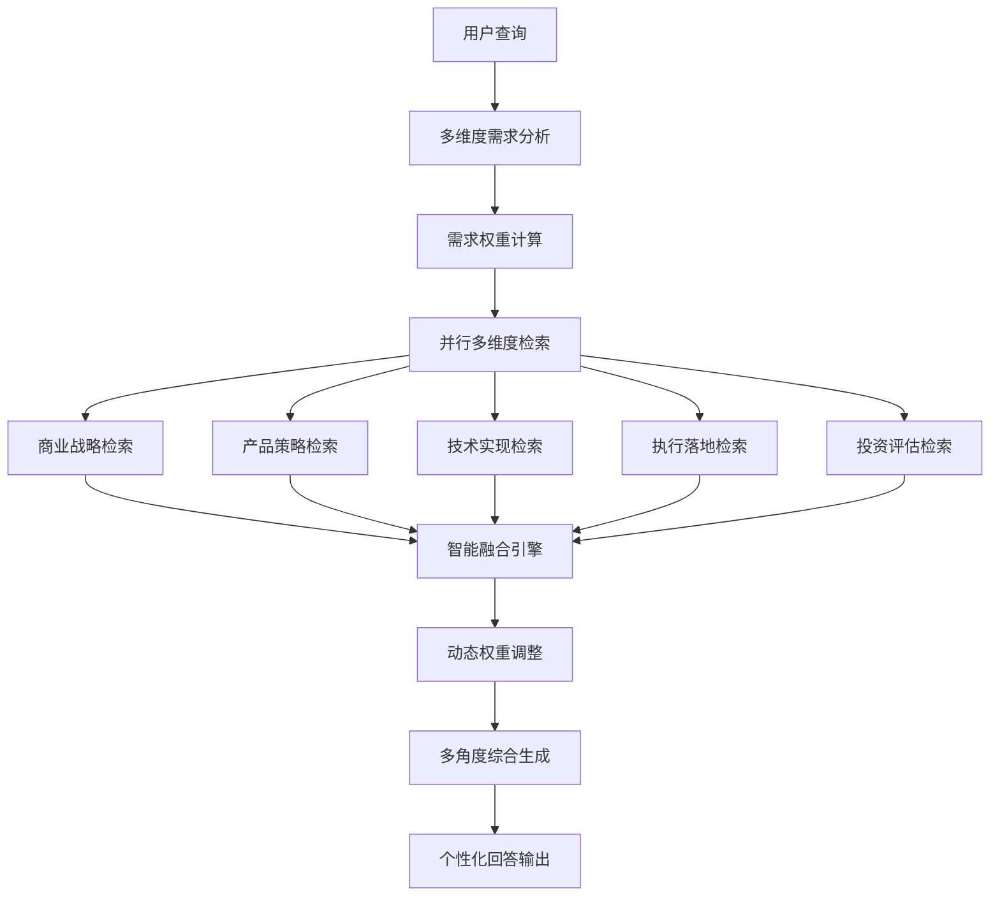

# 商业案例RAG系统多管道优化方案

## 📊 现有架构分析

### 当前系统特点
基于对 `examples/` 目录的分析，UltraRAG系统支持以下管道模式：

1. **基础RAG管道** (`rag.yaml`)：线性处理流程
2. **循环迭代管道** (`IRCoT.yaml`, `IterRetGen.yaml`)：支持多轮检索和生成
3. **条件分支管道** (`light_deepresearch.yaml`)：基于路由器的智能分支
4. **专用任务管道** (`rag_multiple_choice.yaml`)：针对特定任务优化

### 核心能力模块
- **路由器服务** (`servers/router`)：支持基于内容的智能分支
- **自定义服务** (`servers/custom`)：灵活的数据处理和转换
- **检索服务** (`servers/retriever`)：多种检索策略
- **生成服务** (`servers/generation`)：LLM生成能力
- **提示词服务** (`servers/prompt`)：模板化提示词管理

## 🎯 用户需求的多维度分析

### 💡 **核心洞察**：跨领域学习的普遍性
任何背景的用户都可能对商业的不同维度感兴趣：
- **AI工程师** 想了解商业逻辑，为技术决策提供商业视角
- **产品经理** 需要深入理解技术实现，也关心商业模式创新
- **创业者** 既要懂技术趋势，也要掌握产品方法论和实施策略
- **投资人** 需要全方位评估：技术壁垒、产品竞争力、商业可行性

### 🔍 **需求维度分析**（而非用户分类）

#### 📈 **商业战略维度**
**关注焦点**：商业模式、市场机会、竞争策略、价值创造
**典型问题**：
- "这个商业模式的核心逻辑是什么？"
- "市场时机和竞争格局如何判断？"
- "如何构建可持续的竞争优势？"

#### 🎯 **产品策略维度**  
**关注焦点**：用户需求、产品设计、功能规划、体验优化
**典型问题**：
- "用户真正的痛点和需求是什么？"
- "产品功能应该如何设计和迭代？"
- "如何平衡功能复杂度与用户体验？"

#### ⚡ **技术实现维度**
**关注焦点**：技术选型、架构设计、实现路径、技术壁垒
**典型问题**：
- "技术实现的关键难点在哪里？"
- "如何选择合适的技术方案？"
- "技术优势如何转化为商业价值？"

#### 🚀 **执行落地维度**
**关注焦点**：项目管理、风险控制、资源配置、实施策略
**典型问题**：
- "项目应该如何规划和执行？"
- "主要风险点和应对策略是什么？"
- "如何评估投入产出和ROI？"

#### 💰 **投资评估维度**
**关注焦点**：市场价值、财务模型、投资回报、估值逻辑
**典型问题**：
- "这个项目的投资价值如何？"
- "财务模型和盈利预期是否合理？"
- "估值逻辑和对标公司分析？"

## 🚀 多维度智能融合管道架构设计

### 架构概览



### 核心设计理念

#### 1. 🎯 **需求维度识别**（替代用户分类）
**功能**：分析查询中包含的多个需求维度及其权重
**实现**：基于语义分析和关键词匹配的多标签分类

#### 2. 🔄 **并行多维度检索**
**策略**：同时从5个维度检索相关内容，而非单一维度
**优势**：确保回答的全面性和多角度视角

#### 3. 🧠 **智能融合引擎**
**功能**：根据需求权重智能融合不同维度的信息
**特点**：动态调整各维度内容的比重和呈现方式

#### 4. 🎨 **多角度综合生成**
**理念**：一个回答涵盖多个维度，而非单一角色视角
**实现**：基于融合后的上下文生成综合性专业回答

## 📋 具体实施方案

### 阶段一：路由器增强 (1-2周)

#### 1.1 创建多维度需求分析器
**文件**: `servers/router/src/business_router.py`

```python
@app.tool(output="query_analysis")
def analyze_multi_dimensional_needs(query_list: List[str]) -> Dict[str, List[Dict[str, Any]]]:
    """
    分析查询的多维度需求权重，支持跨领域综合分析
    """
    def analyze_query_dimensions(query: str) -> Dict[str, float]:
        # 商业战略维度关键词
        business_keywords = [
            "商业模式", "市场机会", "竞争策略", "商业价值", "盈利模式", 
            "变现", "估值", "融资", "投资", "商业计划", "市场分析"
        ]
        
        # 产品策略维度关键词  
        product_keywords = [
            "产品设计", "用户体验", "功能", "需求分析", "用户增长", "产品策略",
            "竞品分析", "产品指标", "用户画像", "产品规划", "迭代", "MVP"
        ]
        
        # 技术实现维度关键词
        tech_keywords = [
            "技术实现", "架构设计", "技术选型", "开发", "算法", "系统",
            "技术壁垒", "技术优势", "实现方案", "技术难点", "工程化"
        ]
        
        # 执行落地维度关键词
        execution_keywords = [
            "实施", "落地", "项目管理", "执行", "部署", "运营", "管理", 
            "流程", "方案", "团队", "资源配置", "里程碑", "交付"
        ]
        
        # 投资评估维度关键词
        investment_keywords = [
            "ROI", "投资回报", "成本", "收益", "财务", "估值", "风险评估",
            "市场价值", "商业价值", "盈利预期", "资金", "预算"
        ]
        
        query_lower = query.lower()
        
        # 计算各维度权重（0-1之间）
        dimensions = {
            "business_strategy": sum(1 for kw in business_keywords if kw in query_lower),
            "product_strategy": sum(1 for kw in product_keywords if kw in query_lower),
            "tech_implementation": sum(1 for kw in tech_keywords if kw in query_lower),
            "execution_management": sum(1 for kw in execution_keywords if kw in query_lower),
            "investment_evaluation": sum(1 for kw in investment_keywords if kw in query_lower)
        }
        
        # 归一化权重
        total_score = sum(dimensions.values())
        if total_score == 0:
            # 如果没有明确关键词，给予均等权重，鼓励全面分析
            return {dim: 0.2 for dim in dimensions.keys()}
        
        normalized_weights = {
            dim: score / total_score for dim, score in dimensions.items()
        }
        
        # 确保至少有基础权重，避免某个维度完全被忽略
        min_weight = 0.1
        for dim in normalized_weights:
            if normalized_weights[dim] < min_weight:
                normalized_weights[dim] = min_weight
        
        # 重新归一化
        total_weight = sum(normalized_weights.values())
        normalized_weights = {
            dim: weight / total_weight for dim, weight in normalized_weights.items()
        }
        
        return normalized_weights
    
    analyzed_queries = []
    for query in query_list:
        dimension_weights = analyze_query_dimensions(query)
        
        # 确定主导维度（用于后续处理）
        primary_dimension = max(dimension_weights, key=dimension_weights.get)
        
        analyzed_queries.append({
            "query": query,
            "dimension_weights": dimension_weights,
            "primary_dimension": primary_dimension,
            "is_multi_dimensional": len([w for w in dimension_weights.values() if w > 0.15]) > 2
        })
    
    return {"query_analysis": analyzed_queries}
```

#### 1.2 创建多维度融合管道配置

**文件**: `examples/business_multi_dimensional_pipeline.yaml`

```yaml
# 商业案例多维度智能融合管道配置

servers:
  benchmark: servers/benchmark
  retriever: servers/retriever
  prompt: servers/prompt
  generation: servers/generation
  evaluation: servers/evaluation
  custom: servers/custom
  router: servers/router

pipeline:
- benchmark.get_data

# 第一步：多维度需求分析
- router.analyze_multi_dimensional_needs

# 第二步：并行多维度检索
- parallel:
    steps:
    # 商业战略维度检索
    - retriever.retriever_search_lancedb:
        input:
          filter_expr: "dimension = 'business_strategy' OR category LIKE '%business%' OR category LIKE '%strategy%'"
          top_k: 4
        output:
          ret_psg: business_psg
    
    # 产品策略维度检索  
    - retriever.retriever_search_lancedb:
        input:
          filter_expr: "dimension = 'product_strategy' OR category LIKE '%product%' OR category LIKE '%user%'"
          top_k: 4
        output:
          ret_psg: product_psg
    
    # 技术实现维度检索
    - retriever.retriever_search_lancedb:
        input:
          filter_expr: "dimension = 'tech_implementation' OR category LIKE '%tech%' OR category LIKE '%implementation%'"
          top_k: 3
        output:
          ret_psg: tech_psg
    
    # 执行落地维度检索
    - retriever.retriever_search_lancedb:
        input:
          filter_expr: "dimension = 'execution_management' OR category LIKE '%management%' OR category LIKE '%execution%'"
          top_k: 3
        output:
          ret_psg: execution_psg
    
    # 投资评估维度检索
    - retriever.retriever_search_lancedb:
        input:
          filter_expr: "dimension = 'investment_evaluation' OR category LIKE '%investment%' OR category LIKE '%financial%'"
          top_k: 3
        output:
          ret_psg: investment_psg

# 第三步：智能融合多维度内容
- custom.intelligent_multi_dimensional_fusion:
    input:
      query_analysis: query_analysis
      business_psg: business_psg
      product_psg: product_psg
      tech_psg: tech_psg
      execution_psg: execution_psg
      investment_psg: investment_psg

# 第四步：多角度综合生成
- prompt.multi_dimensional_mentor_template
- generation.generate:
    input:
      model_name: "qwen-plus"
      temperature: 0.7
      max_tokens: 4000

- custom.extract_answer
- evaluation.evaluate
```

### 阶段二：专业化提示词模板 (2-3周)

#### 2.1 多维度综合导师模板
**文件**: `prompt/multi_dimensional_mentor.jinja`

```jinja2
你是一位全栈商业导师，具备跨领域的深厚经验：既有技术创业背景，又有产品管理经验，还有投资和项目实施的丰富阅历。你善于从多个角度综合分析商业问题，为不同背景的学习者提供全面而深入的指导。

🎯 **综合专业能力**：
- 🚀 **商业战略**: 商业模式设计、市场分析、竞争策略
- 🎯 **产品策略**: 用户体验、产品规划、增长运营  
- ⚡ **技术实现**: 技术选型、架构设计、工程化实践
- 📋 **执行管理**: 项目管理、风险控制、团队协作
- 💰 **投资评估**: 财务分析、ROI评估、价值评估


📚 **之前的学习讨论**:
{{ formatted_context.history }}


📊 **多维度案例分析**:
{{ formatted_context.fused_content }}

**需求维度权重**: {{ query_analysis.dimension_weights }}
**是否多维度问题**: {{ query_analysis.is_multi_dimensional }}

---

**综合分析原则**:
1. 🔄 **全局视角**: 从商业全链条角度思考问题
2. 🎯 **重点突出**: 根据问题特点突出相关维度分析
3. 🤝 **跨界融合**: 将不同领域的知识有机结合
4. 💡 **启发思考**: 引导学习者建立系统性思维
5. 🚀 **实用导向**: 提供可操作的具体建议

**学习者问题**: {{ question }}

**多维度综合分析**:


## 🚀 商业战略视角
从商业模式、市场机会、竞争策略等角度分析：
[基于商业战略相关案例进行深入分析]



## 🎯 产品策略视角  
从用户需求、产品设计、增长策略等角度分析：
[基于产品策略相关案例进行深入分析]



## ⚡ 技术实现视角
从技术选型、实现路径、技术壁垒等角度分析：
[基于技术实现相关案例进行深入分析]



## 📋 执行管理视角
从项目管理、风险控制、团队协作等角度分析：
[基于执行管理相关案例进行深入分析]



## 💰 投资评估视角
从财务模型、投资回报、价值评估等角度分析：
[基于投资评估相关案例进行深入分析]


## 🔗 跨维度综合洞察
将以上不同维度的分析进行有机整合，提供系统性的综合建议：

✅ **核心问题识别**: 基于多维度分析识别关键问题和机会点
✅ **解决方案设计**: 提供兼顾各个维度的综合解决方案
✅ **实施优先级**: 建议分阶段实施的优先级和关键路径
✅ **风险机会评估**: 全面评估各维度的风险点和机会点
✅ **成功关键因素**: 识别项目成功的关键成功因素

💡 **深度思考引导**:
基于您的问题和背景，我建议您进一步思考以下几个问题：
1. [针对主要维度的深度思考问题]
2. [跨维度整合的思考问题] 
3. [实践应用的思考问题]

🎓 **学习建议**:
根据您的问题特点，建议您接下来重点关注：
- [基于维度权重的学习重点建议]
- [相关案例的深入研究方向]
- [实践验证的具体方法]
```

### 阶段三：自定义服务扩展 (2-3周)

#### 3.1 智能多维度融合服务
**文件**: `servers/custom/src/business_custom.py`

```python
from typing import List, Dict, Any
from ultrarag.server import UltraRAG_MCP_Server

app = UltraRAG_MCP_Server("business_custom")

@app.tool(output="formatted_context")
def intelligent_multi_dimensional_fusion(
    query_analysis: List[Dict[str, Any]],
    business_psg: List[List[List[str]]] = None,
    product_psg: List[List[List[str]]] = None,
    tech_psg: List[List[List[str]]] = None,
    execution_psg: List[List[List[str]]] = None,
    investment_psg: List[List[List[str]]] = None,
    chat_history: List[Dict] = None
) -> Dict[str, Any]:
    """
    智能融合多维度检索结果，根据需求权重动态调整内容比重
    """
    if not query_analysis or len(query_analysis) == 0:
        return {"formatted_context": {"fused_content": "", "query_analysis": {}}}
    
    # 获取第一个查询的分析结果（支持批量处理时可扩展）
    analysis = query_analysis[0]
    dimension_weights = analysis.get("dimension_weights", {})
    
    # 收集所有维度的内容
    dimensional_content = {
        "business_strategy": business_psg or [],
        "product_strategy": product_psg or [],
        "tech_implementation": tech_psg or [],
        "execution_management": execution_psg or [],
        "investment_evaluation": investment_psg or []
    }
    
    # 根据权重融合内容
    fused_sections = []
    
    # 按权重排序维度
    sorted_dimensions = sorted(
        dimension_weights.items(), 
        key=lambda x: x[1], 
        reverse=True
    )
    
    for dimension, weight in sorted_dimensions:
        if weight > 0.1 and dimension in dimensional_content:  # 只处理有意义权重的维度
            content = dimensional_content[dimension]
            if content and len(content) > 0:
                section = format_dimensional_content(
                    dimension, content, weight, analysis.get("is_multi_dimensional", False)
                )
                if section:
                    fused_sections.append(section)
    
    # 格式化历史记录
    history_content = ""
    if chat_history:
        history_parts = ["## 📚 之前的学习对话"]
        for msg in chat_history[-4:]:  # 保留最近4轮对话
            if msg.get('role') == 'user':
                history_parts.append(f"**学习者**: {msg.get('content', '')}")
            elif msg.get('role') == 'assistant':
                # 截取回答的关键部分
                content = msg.get('content', '')
                summary = content[:150] + "..." if len(content) > 150 else content
                history_parts.append(f"**导师**: {summary}")
        history_parts.append("")
        history_content = "\n".join(history_parts)
    
    # 组合最终内容
    fused_content = "\n\n".join(fused_sections)
    
    return {
        "formatted_context": {
            "fused_content": fused_content,
            "history": history_content,
            "query_analysis": analysis
        }
    }

def format_dimensional_content(
    dimension: str, 
    content: List[List[List[str]]], 
    weight: float,
    is_multi_dimensional: bool
) -> str:
    """格式化单个维度的内容"""
    
    dimension_names = {
        "business_strategy": "🚀 商业战略",
        "product_strategy": "🎯 产品策略", 
        "tech_implementation": "⚡ 技术实现",
        "execution_management": "📋 执行管理",
        "investment_evaluation": "💰 投资评估"
    }
    
    dimension_name = dimension_names.get(dimension, dimension)
    
    # 根据权重决定内容详细程度
    if weight > 0.3:
        max_items = 4  # 高权重维度显示更多内容
        detail_level = "详细"
    elif weight > 0.2:
        max_items = 3
        detail_level = "中等"
    else:
        max_items = 2  # 低权重维度显示精简内容
        detail_level = "精简"
    
    section_parts = [f"## {dimension_name} (权重: {weight:.1%}, {detail_level}分析)"]
    
    if content and len(content) > 0:
        for i, query_results in enumerate(content[:1]):  # 只处理第一个查询的结果
            if query_results:
                item_count = 0
                for j, (text, score) in enumerate(query_results):
                    if item_count >= max_items:
                        break
                    if text.strip() and score > 0.5:  # 只选择高质量内容
                        # 根据维度增强内容
                        enhanced_text = enhance_content_by_dimension(text, dimension)
                        
                        # 根据权重调整内容长度
                        if weight < 0.2:
                            # 低权重维度，截取关键部分
                            enhanced_text = enhanced_text[:200] + "..." if len(enhanced_text) > 200 else enhanced_text
                        
                        section_parts.append(f"### 📄 相关案例 {item_count + 1} (相似度: {score:.2f})")
                        section_parts.append(enhanced_text)
                        section_parts.append("")
                        item_count += 1
    
    return "\n".join(section_parts) if len(section_parts) > 1 else ""

def enhance_content_by_dimension(content: str, dimension: str) -> str:
    """根据维度增强内容显示"""
    import re
    
    dimension_keywords = {
        "business_strategy": [
            "商业模式", "盈利模式", "市场机会", "竞争策略", "商业价值", 
            "市场规模", "用户规模", "收入来源", "成本结构"
        ],
        "product_strategy": [
            "用户体验", "产品功能", "用户增长", "产品策略", "用户需求",
            "产品设计", "功能规划", "用户画像", "产品迭代"
        ],
        "tech_implementation": [
            "技术实现", "架构设计", "技术选型", "算法", "系统设计",
            "技术壁垒", "开发", "工程化", "技术优势"
        ],
        "execution_management": [
            "项目管理", "实施", "执行", "团队", "资源配置",
            "里程碑", "交付", "流程", "管理", "协作"
        ],
        "investment_evaluation": [
            "ROI", "投资回报", "成本", "收益", "财务", "估值",
            "投资", "资金", "预算", "盈利", "回报率"
        ]
    }
    
    keywords = dimension_keywords.get(dimension, [])
    enhanced = content
    
    for keyword in keywords:
        enhanced = re.sub(f"({keyword})", r"**\1**", enhanced)
    
    return enhanced

@app.tool(output="formatted_context")
def format_context_with_weights(
    ret_psg: List[List[List[str]]], 
    dimension_weights: Dict[str, float],
    chat_history: List[Dict] = None
) -> Dict[str, str]:
    """
    兼容原有接口的权重化上下文格式化
    """
    if chat_history is None:
        chat_history = []
    
    # 确定主导维度
    primary_dimension = max(dimension_weights, key=dimension_weights.get) if dimension_weights else "general"
    
    context_parts = []
    if ret_psg and len(ret_psg) > 0:
        context_parts.append(f"## 📊 相关案例分析 (主导维度: {primary_dimension})")
        
        for i, query_results in enumerate(ret_psg):
            if query_results:
                for j, (content, score) in enumerate(query_results):
                    if content.strip():
                        # 根据主导维度增强内容
                        enhanced_content = enhance_content_by_dimension(content, primary_dimension)
                        context_parts.append(f"### 📄 案例片段 {j+1} (相关度: {score:.3f})")
                        context_parts.append(enhanced_content)
                        context_parts.append("")
    
    # 格式化历史记录
    history_parts = []
    if chat_history:
        history_parts.append("## 📚 之前的学习对话")
        for msg in chat_history[-3:]:
            if msg.get('role') == 'user':
                history_parts.append(f"**学习者**: {msg.get('content', '')}")
            elif msg.get('role') == 'assistant':
                history_parts.append(f"**导师**: {msg.get('content', '')[:150]}...")
        history_parts.append("")
    
    formatted_context = {
        "history": "\n".join(history_parts),
        "documents": "\n".join(context_parts),
        "dimension_weights": dimension_weights,
        "primary_dimension": primary_dimension
    }
    
    return {"formatted_context": formatted_context}

if __name__ == "__main__":
    app.run(transport="stdio")
```

### 阶段四：数据层优化 (1-2周)

#### 4.1 知识库重新标注
为现有案例数据添加分类标签，支持精准检索：

```python
# 数据标注脚本示例
case_categories = {
    "学霸君": ["business_model", "market_analysis", "failure_case", "education"],
    "泡泡玛特": ["business_model", "user_growth", "product_strategy", "ip_economy"],
    "蜜雪冰城": ["business_model", "market_strategy", "cost_control", "franchise"],
    "B站": ["product_strategy", "user_growth", "community_building", "content_platform"],
    # ... 更多案例标注
}
```

#### 4.2 检索策略优化
```yaml
# 不同用户类型的检索配置
retrieval_configs:
  entrepreneur:
    filter_categories: ["business_model", "market_analysis", "investment", "failure_case"]
    top_k: 8
    score_threshold: 0.7
    
  product_manager:
    filter_categories: ["product_strategy", "user_growth", "feature_design", "user_experience"]
    top_k: 6
    score_threshold: 0.75
    
  implementation:
    filter_categories: ["implementation", "risk_management", "project_case", "cost_control"]
    top_k: 7
    score_threshold: 0.72
```

## 📊 效果评估指标

### 用户满意度指标
- **回答相关性**: 针对不同用户类型的专业度评分
- **内容深度**: 分析深度和实用性评估
- **响应时间**: 多管道处理的性能表现

### 系统性能指标  
- **路由准确率**: 意图识别的准确性
- **检索精度**: 不同管道的检索质量
- **生成质量**: 专业化回答的质量评估

### 业务价值指标
- **用户留存**: 不同用户类型的使用粘性
- **问题解决率**: 用户问题的有效解决比例
- **专业认可度**: 行业专家的反馈评价

## 🔄 迭代优化计划

### 短期优化 (1个月内)
1. **完善意图识别**: 基于用户反馈优化分类算法
2. **丰富案例库**: 增加更多细分领域的案例内容
3. **优化提示词**: 根据实际使用效果调整模板

### 中期优化 (3个月内)  
1. **引入用户画像**: 基于历史行为建立用户模型
2. **动态权重调整**: 根据用户反馈动态调整检索权重
3. **多模态支持**: 增加图表、数据可视化等内容

### 长期优化 (6个月内)
1. **个性化推荐**: 基于用户兴趣推荐相关案例
2. **协作学习**: 支持多用户协作分析案例
3. **知识图谱**: 构建商业案例知识图谱增强推理

## 🎯 总结

本方案基于UltraRAG现有的强大管道架构能力，通过智能路由和专业化定制，为三类目标用户提供精准的商业案例分析服务。方案具有以下优势：

✅ **架构兼容**: 充分利用现有的路由、检索、生成等服务模块
✅ **渐进实施**: 可分阶段实施，降低开发和部署风险  
✅ **专业定制**: 针对不同用户群体提供专业化的服务体验
✅ **可扩展性**: 易于添加新的用户类型和业务场景
✅ **性能优化**: 通过精准路由和检索提升系统效率

通过这套多管道架构，系统将能够更好地服务于AI应用创业者、AI产品经理和商业落地专家的不同需求，提供更专业、更精准的商业案例分析和指导。